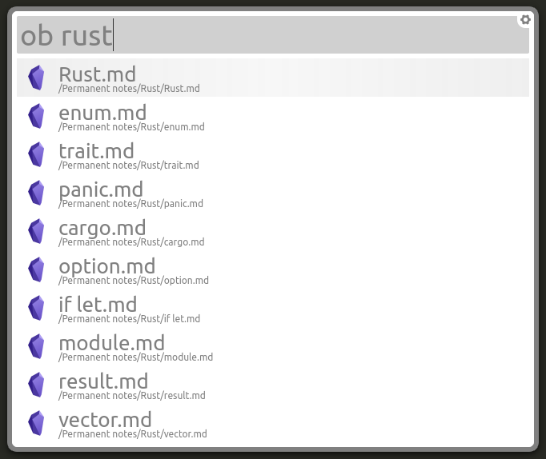

# Obsidian-albert-plugin



A simple plugin that makes it possible to search your [Obsidian](https://obsidian.md/) vault.

## Features
- Search Obsidian vault based on title of your note.
- Add custom command using build in URIs.

## Install

### Download code
```bash
git clone https://github.com/j0rd1smit/obsidian-albert-plugin.git /usr/share/albert/org.albert.extension.python/modules/obsidian-albert-plugin

```

### Enable plugin
Start up Albert and go to the settings page. On the settings page, go to “Extensions > Python > Obsidian” and enable the Obsidian plugin.

### Configure
An example configuration file should appear at `~/.config/albert/obsidian-plugin/config.json` after you have enabled the plugin. In this configuration file, you **must** specify the following:
- **vault_name**: This is the name of your Obsidian folder.
- **path_to_vault**: The absolute path to your vault.

Optionally, you can also add additional commands under `commands`. These commands call specific obsidian URI that preform certain action in your vault. For more information about the available URI in obsidian, see [uing obsidian URI(https://help.obsidian.md/Advanced+topics/Using+obsidian+URI) and [advanced Obsidian URI plugin](https://github.com/Vinzent03/obsidian-advanced-uri).

Here is an example configuration file for reference

```json
{
    "vault_name": "obsidian",
    "path_to_vault": "/home/USERNAME/path/to/vault",
    "commands": [
        {
            "name": "New note",
            "subtext": "Add a new note to the vault",
            "uri_template": "obsidian://new?vault=obsidian&name={{q}}"
        },
        {
	        "name": "Quick add",
	        "subtext": "",
	        "uri_template": "obsidian://advanced-uri?commandname=QuickAdd%3A%20Run%20QuickAdd"
	    }
    ]
}
```